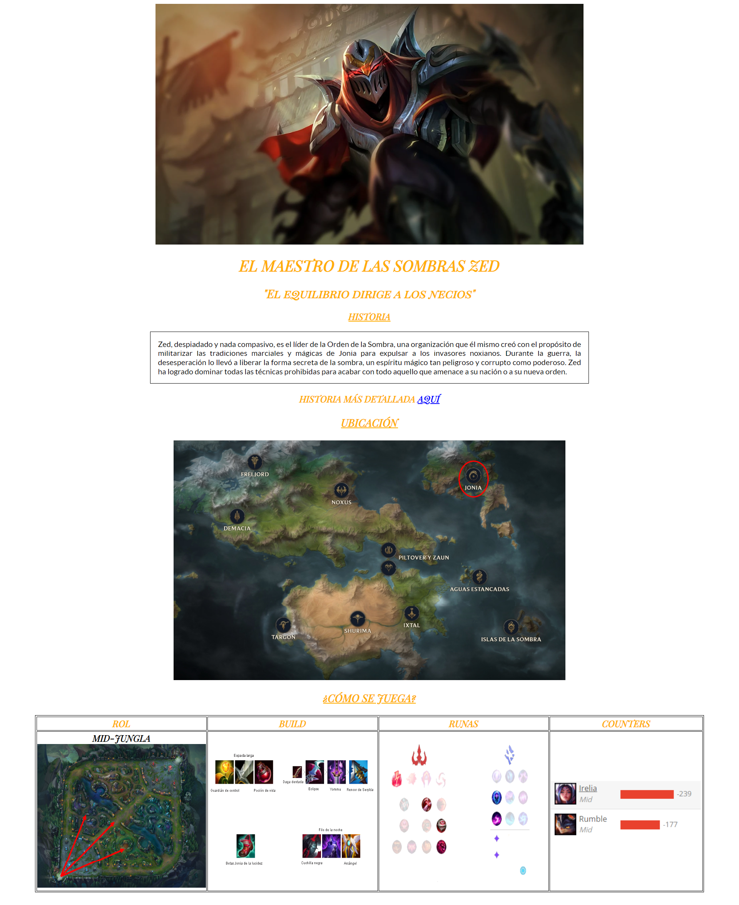

# ASIX1_M4UF1A7_Do-it-yourself_ManavSharma

1. La frase **"HISTORIA MÁS DETALLADA AQUÍ"** la palabra **"AQUÍ"** en el `html`, ha de estar vinculadas (utilizando la etiqueta `a`) a este enlace: "https://leagueoflegendsoficial.fandom.com/es/wiki/Zed/Historia#EUW"

2. Utilizar [Font Awesome](https://fontawesome.com/) para añadir un icono de página.

3. Utilizar [Google Fonts](https://fonts.google.com/) para cambiar el tipo de fuente del documento (FUENTES: **Playfair Display SC** y **Lato**).

4. Mediante una hoja de **estilos externos** se ha de aplicar formato a la página web de manera que:

    * Regla 1. Utilizar el selector universal `*` para cambiar el tipo de fuente del documento a `font-family: 'Playfair Display SC', serif;`, alinear el texto al centro `text-align: center;` y cambiar el color de la letra a `rgb(255, 174, 0)`.

    * Regla 2. Los hijos `img` con padre `div` tendrán una altura de `500px`, un margen automático y `display: block;`.

    * Regla 3. Los hijos `h3` con padre `div` estarán subrallados.

    * Regla 4. Los hijos `p` con padre `div` tendrán las siguientes características:
* Color de texto negro.
* Un borde sólido de 1px de color negro.
* un `padding` del 1%.
* Su fuente de letra será ` font-family: 'Lato', sans-serif;`.
* Los margenes tanto izquierda como derecha tendrán un 20%.
* Y además un `text-align:justify;`
    
    * Regla 5. La tabla tendrá un borde sólido de 1px de color negro y los margenes automáticos.

    * Regla 6. El `th` tendrá un bordillo sólido de color negro de 1px de grosor.
    
    * Regla 7. Los hijos `img` con padre `th` tendrán una altura de `300px` y una anchura de `350px`.

    * Regla 8. Las imágenes con clase `counter` tendrán una altura automática y anchura del `100%`.

    * Regla 9. Los `th` con clase `MidJng` tendrán un color negro.

    * Regla 10. Los `a` con clase `Link` tendrán un color azul.

El resultado:

    

# ASIX1_M4UF1A7_DoItYourselfManu_JuliaSuarez
